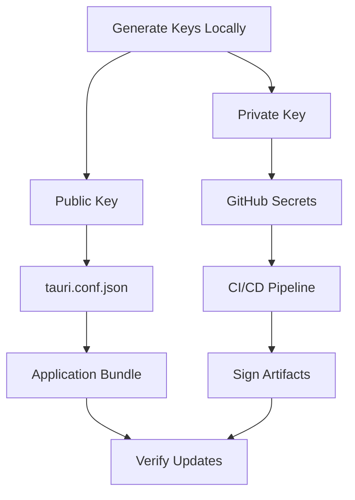

# 📝 Tauri Signing & Auto-Update Configuration Guide

## 🎯 Overview

This guide provides a production-ready setup for Tauri v2 code signing and auto-update functionality.

## 🔑 Key Management Architecture



## 🚀 Quick Setup

### Step 1: Generate Signing Keys

```powershell
# Windows
.\scripts\setup-signing.ps1 -CI

# macOS/Linux
pnpm tauri signer generate --ci -w ~/.tauri/myapp.key
```

### Step 2: Configure GitHub Secrets

1. Go to: `https://github.com/YOUR_REPO/settings/secrets/actions`
2. Create these secrets:

| Secret Name | Value | Required |
|------------|-------|----------|
| `TAURI_SIGNING_PRIVATE_KEY` | Content of generated `.key` file | ✅ Yes |
| `TAURI_SIGNING_PRIVATE_KEY_PASSWORD` | Empty string (for CI keys) | ✅ Yes |

### Step 3: Update tauri.conf.json

```json
{
  "bundle": {
    "createUpdaterArtifacts": true
  },
  "plugins": {
    "updater": {
      "pubkey": "YOUR_BASE64_ENCODED_PUBLIC_KEY",
      "endpoints": [
        "https://github.com/YOUR_REPO/releases/latest/download/latest.json"
      ]
    }
  }
}
```

## 🔧 Advanced Configuration

### Conditional Signing

For repositories that may not always have signing configured:

```javascript
// build.js - Dynamic configuration
const fs = require('fs');
const config = JSON.parse(fs.readFileSync('src-tauri/tauri.conf.json'));

// Check if signing is available
const hasSigningKey = process.env.TAURI_SIGNING_PRIVATE_KEY ||
                      process.env.CI === 'true';

// Enable/disable updater artifacts accordingly
config.bundle.createUpdaterArtifacts = hasSigningKey;

fs.writeFileSync('src-tauri/tauri.conf.json',
                  JSON.stringify(config, null, 2));
```

### Multi-Environment Setup

```yaml
# .github/workflows/release.yml
env:
  # Development builds - no signing
  ENABLE_SIGNING: ${{ github.ref_type == 'tag' }}

  # Production builds - require signing
  TAURI_SIGNING_PRIVATE_KEY: ${{ secrets.TAURI_SIGNING_PRIVATE_KEY }}
  TAURI_SIGNING_PRIVATE_KEY_PASSWORD: ${{ secrets.TAURI_SIGNING_PRIVATE_KEY_PASSWORD }}
```

## 🛡️ Security Best Practices

### 1. Key Rotation Schedule

```yaml
# Recommended rotation schedule
Development Keys: Every 6 months
Production Keys: Every 12 months
Emergency Rotation: Immediately if compromised
```

### 2. Access Control

```yaml
# GitHub repository settings
- Require reviews for secret changes
- Limit secret access to protected branches
- Enable audit logs for secret access
```

### 3. Backup Strategy

```bash
# Secure key backup
gpg --symmetric --cipher-algo AES256 tauri.key
# Store encrypted backup in secure location
```

## 🐛 Troubleshooting

### Common Issues and Solutions

| Error | Cause | Solution |
|-------|-------|----------|
| `incorrect updater private key password` | Encrypted key without password | Use `--ci` flag when generating |
| `Missing comment in secret key` | Malformed key format | Regenerate with official CLI |
| `UnexpectedKeyId` | Public/private key mismatch | Ensure keys are from same pair |
| `No .tar.gz updater artifact found` | Updater disabled or build failed | Check `createUpdaterArtifacts` setting |

### Debug Commands

```bash
# Verify key format
cat tauri.key | head -1
# Should show: "untrusted comment: ..."

# Test signing locally
TAURI_SIGNING_PRIVATE_KEY=$(cat tauri.key) \
TAURI_SIGNING_PRIVATE_KEY_PASSWORD="" \
pnpm tauri build --ci

# Check GitHub secret
gh secret list --repo YOUR_REPO
```

## 📊 Migration Strategies

### From Tauri v1 to v2

```bash
# Old (v1)
TAURI_KEY_PASSWORD

# New (v2)
TAURI_SIGNING_PRIVATE_KEY_PASSWORD
```

### From Password-Protected to CI Keys

1. Generate new CI-compatible keys
2. Update GitHub Secrets
3. Clear password secret or set to empty
4. Update workflow to use `--ci` flag

## 🔄 CI/CD Integration

### GitHub Actions

```yaml
- name: Build with Smart Signing
  env:
    TAURI_SIGNING_PRIVATE_KEY: ${{ secrets.TAURI_SIGNING_PRIVATE_KEY }}
    TAURI_SIGNING_PRIVATE_KEY_PASSWORD: ${{ secrets.TAURI_SIGNING_PRIVATE_KEY_PASSWORD }}
    CI: true
  run: |
    # Detect if signing is available
    if [ -n "$TAURI_SIGNING_PRIVATE_KEY" ]; then
      echo "✅ Building with signing enabled"
      pnpm tauri build --ci
    else
      echo "⚠️ Building without signing"
      pnpm tauri build --ci --config '{"bundle":{"createUpdaterArtifacts":false}}'
    fi
```

### GitLab CI

```yaml
build:
  variables:
    CI: "true"
  script:
    - pnpm tauri build --ci
  secrets:
    TAURI_SIGNING_PRIVATE_KEY:
      vault: production/tauri/signing_key
    TAURI_SIGNING_PRIVATE_KEY_PASSWORD:
      vault: production/tauri/signing_password
```

## 📈 Monitoring & Analytics

### Update Success Rate

```javascript
// In your Tauri app
import { check } from '@tauri-apps/plugin-updater';

async function checkUpdateWithTelemetry() {
  try {
    const update = await check();

    // Log to analytics
    analytics.track('update_check', {
      available: update?.available,
      version: update?.version,
      success: true
    });

    return update;
  } catch (error) {
    // Log failures for monitoring
    analytics.track('update_check', {
      success: false,
      error: error.message
    });
    throw error;
  }
}
```

## 🚦 Rollback Procedures

If an update causes issues:

1. **Immediate Mitigation**:
   ```bash
   # Remove problematic release
   gh release delete v1.2.3 --yes --repo YOUR_REPO
   ```

2. **Fix and Re-release**:
   ```bash
   # Create fixed version
   git tag v1.2.4 -m "Hotfix for v1.2.3 issues"
   git push origin v1.2.4
   ```

3. **Notify Users**:
   - Update release notes
   - Consider in-app notifications
   - Monitor telemetry for adoption

## 📚 Additional Resources

- [Tauri v2 Updater Plugin](https://v2.tauri.app/plugin/updater/)
- [GitHub Actions Security](https://docs.github.com/en/actions/security-guides)
- [minisign Documentation](https://jedisct1.github.io/minisign/)

---

*Last Updated: November 2024*
*Tauri Version: v2.0+*